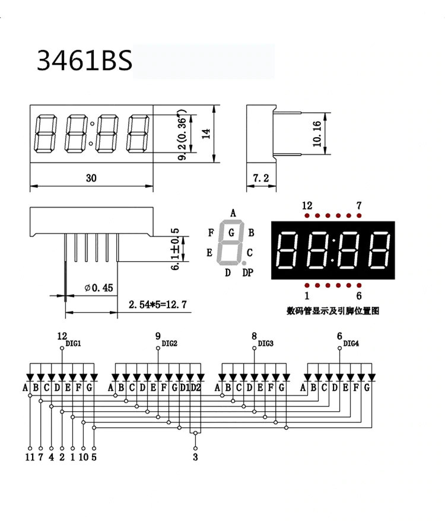
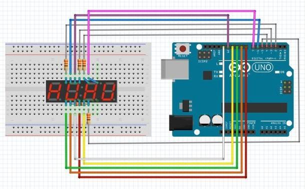
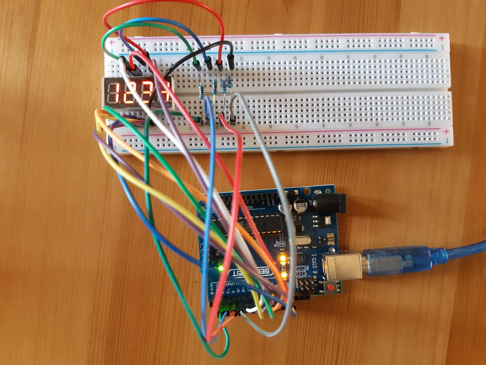

# Arduino experiments
Arduino experiments using pyfirmata library.
You must first load the pyfirmata firmware in the Arduino, 
which will act as a server. 
Then, you command Arduino using your PC as a client, 
for instance using a python program and pyfirmata client library.

## 4-digit leds experiment
Here I use a 3461BS-1 component:

You need digital outputs for all Arduino pins from 2 to 14: 4 pins 
for the 4 digits, 7 pins for each digit's leds (A,..,G), and 1 pin 
for each digit's point (DF). 
Pins [6, 8, 9, 12] of **3461BS** control each digit, 
and must be connected to Arduino pins through a resistor 
(here I use a 220 ohm resistor).
Pins [2, 3, 4, 5] of **Arduino** control each 3461BS's digit, 
whereas pins [6, 7, 8, 9, 10, 11, 12, 13] control the leds for each digit.

**Digit pin mapping:**
   
     Arduino        3461BS
           2            12     
           3             9
           4             8
           5             6

**7 led pin mapping:**

     Arduino        3461BS
           6            11 => 'A'     
           7             7 => 'B'
           8             4 => 'C'
           9             2 => 'D'
          10             1 => 'E'
          11            10 => 'F'
          12             5 => 'G'
          13             3 => 'DP'

On the breadboard the connections look like this:

The 4-digit-leds.py program uses pyfirmata to command Arduino 
and display all numbers from 1 to 9999. 
Note that when you set a 7 leds number it will go to all 4 digits. 
When you want to display different digits at the same time, 
you have to be careful to switch on and off the digits ordinately 
and with the right refresh, in order to trick the human eye. 
The program takes care of this.

This is an example of the final configuration:

